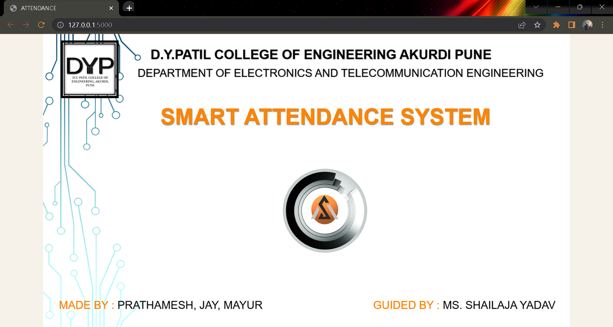
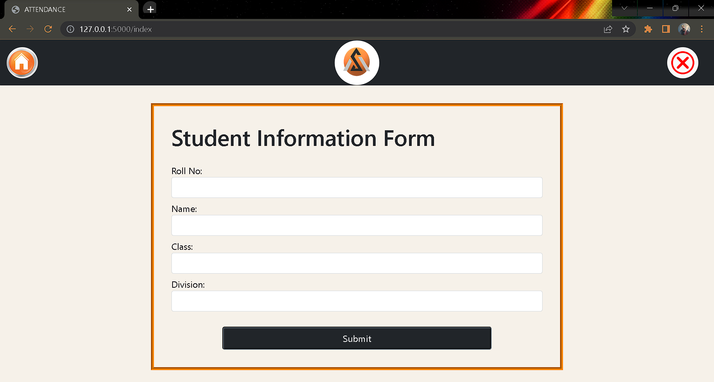
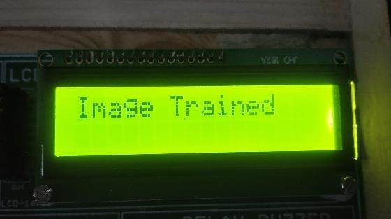

<h1 align="center"> IOT-Based Smart Attendance System</h1>

 

---

## Table of Contents

  <a href="#introduction">Introduction</a> &#xa0; | &#xa0;
  <a href="#features">Features</a> &#xa0; | &#xa0;
  <a href="#modules">Modules</a> &#xa0; | &#xa0;
  <a href="#screenshots">Screenshots</a> &#xa0; | &#xa0;
  <a href="#illustration">Illustration </a> &#xa0; | &#xa0;
  <a href="#results">Results</a> &#xa0; | &#xa0;
  <a href="#requirements">Requirements</a> &#xa0; | &#xa0;
  

 

---

## Introduction

Welcome to the repository for the IOT-based smart attendance system! This system proposes a secure, reliable, and contactless solution for managing attendance using IoT technologies. The system is designed to streamline the attendance process by integrating RFID and Face Recognition technologies, providing a seamless and efficient way to mark attendance.

---

## Features

- **Contactless Attendance:** The system employs RFID and Face Recognition technology, eliminating the need for physical contact during attendance marking.

- **Enhanced Security:** The system enhances security by verifying both the ID of an RFID card and the ID of an individual's face, ensuring accurate attendance records.

- **User Registration and Management:** A web-based interface allows administrators to register users, update their information, and manage attendance-related tasks.

- **Attendance Operations:** Through the web interface, users can mark their attendance, view their attendance history, and download attendance reports.

- **Data Management:** Attendance records are collected and stored in an Excel sheet or a database, ensuring that the attendance data is well-organized and easily accessible for reporting and analysis.

---

## Modules

### 1. Attendance Processing Module

This module is the core of the system and incorporates RFID and Face Recognition technologies. It enables the contactless marking of attendance by verifying the RFID card and the individual's face.

### 2. Web Interface Module

The web interface provides a user-friendly platform for administrators and users to interact with the system. Key functionalities include user registration, attendance marking, and data retrieval.

### 3. Data Management Module

Attendance records are collected and stored in an Excel sheet or a database, ensuring that the attendance data is well-organized and easily accessible for reporting and analysis.

---

## Screenshots

### About Project

### Attendance Dashboard

### Student Registration

### Marked Attendance

---
## Illustration

|  |  |  |
| :--------------------------------: | :---------------------------------------: | :----------------------------------: |
|            Circuit Diagram            |            Raspberry Pi Setup            |            Attendance Marking           |

---

## Results

|      |  |  |
| :--------------------------------:      | :---------------------------------------: | :----------------------------------: |
|            Images saved LCD Display     |         Image Data Trained LCD Display             |           Roll No recognized LCD Display            |

|  |            |  
| :--------------------------------------: | :--------------------------------------: |     
|       Identifying LCD Display        |        Scan your RFID LCD Display            |           

---

## Requirements

To run the IOT-Based Smart Attendance System, you'll need the following:

- Hardware:
  - [RFID Reader]
  - [Pi Camera]
  - [Raspberry Pi]
  - [LCD 16 x 2]
  - [Connecting Wires]

- Software:
  - [Raspbian for Raspberry Pi]
  - [Python 3.x]
  - [SQLite Database]

- Web Browser (for accessing the web interface)

Make sure to install the necessary hardware components, set up the required software, and install the specified libraries and dependencies before running the system.

---
